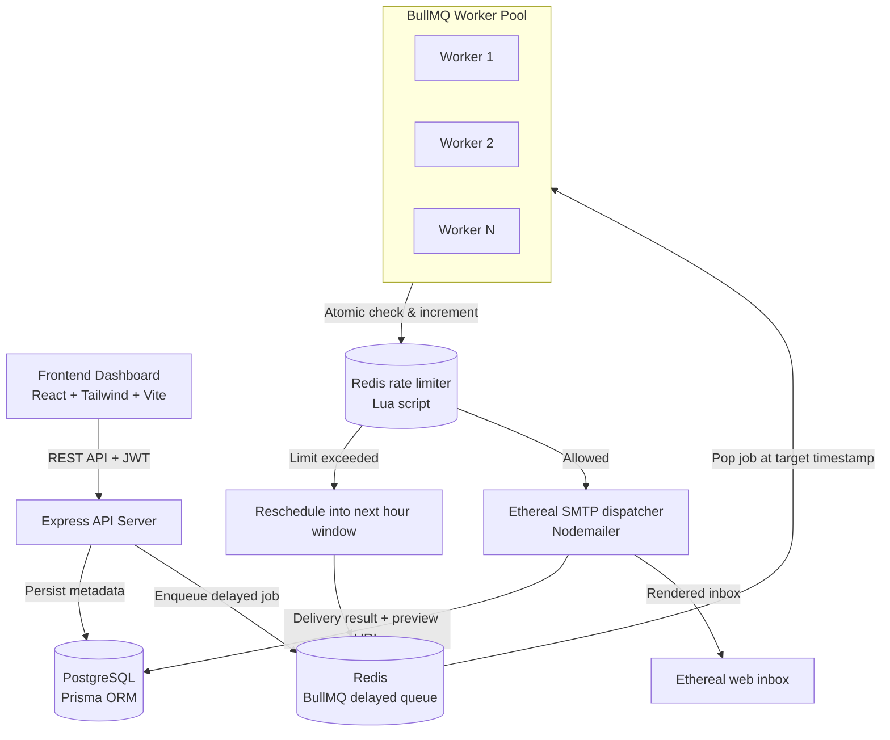

# ReachInbox — High-Throughput Email Scheduler & Dashboard

A distributed email scheduling service with a live dashboard, built on **TypeScript**, **Express**, **BullMQ + Redis**, **PostgreSQL / Prisma**, **Ethereal fake SMTP**, and **React 18 + Tailwind CSS**.

It schedules large batches of emails, staggers delivery per-recipient, enforces a per-sender hourly send limit without dropping jobs, and survives server restarts.

---

## Architecture



---

## How It Works

### 1. Delayed queues instead of cron
Cron pollers (`node-cron`, crontab) hit the database on a fixed interval, which causes lock contention, race conditions across instances, and delivery latency proportional to the poll interval. Instead, each scheduled email becomes a Redis sorted-set entry (BullMQ `delay`) scored by its target execution timestamp, so Redis pops it at the exact millisecond it's due — no polling loop.

Each job's BullMQ `jobId` is set to the Postgres `EmailJob.id`, so a duplicate schedule request or network retry is deduplicated at the Redis level for the **initial** enqueue. (See [Known Limitations](#known-limitations) — this guarantee doesn't currently extend to rescheduled jobs.)

### 2. Configurable worker concurrency
`WORKER_CONCURRENCY` (default `5`) controls how many jobs a single worker process handles in parallel. Multiple worker processes/instances can run against the same queue without duplicate delivery.

### 3. Per-recipient throttling
`DEFAULT_MIN_DELAY_BETWEEN_EMAILS_MS` (default `2000`) simulates provider warm-up pacing between consecutive sends from the same batch.

### 4. Distributed hourly rate limiting
Each sender has a Redis counter keyed `ratelimit:sender:<email>:<YYYY-MM-DD-HH>`, checked and incremented atomically in one round trip:

```lua
local current = redis.call('GET', KEYS[1])
if current and tonumber(current) >= tonumber(ARGV[1]) then
  return {0, tonumber(current)}
else
  local newCount = redis.call('INCR', KEYS[1])
  if newCount == 1 then
    redis.call('EXPIRE', KEYS[1], 7200)
  end
  return {1, newCount}
end
```

If a sender exceeds their hourly limit (e.g. 200/hr) under load, jobs are **not** dropped or marked failed — the worker computes the exact offset to the next hour boundary, marks the row `RESCHEDULED` in Postgres, and re-enqueues it as a new delayed job.

### 5. Restart recovery
BullMQ's Redis-backed sorted sets survive process restarts, so already-enqueued future jobs aren't lost. On boot, `schedulerService.reconcileOnStartup()` resets any row stuck in `PROCESSING` (i.e. the worker died mid-send) back to `SCHEDULED`.

> Note: this reconciliation currently only fixes up Postgres state — see [Known Limitations](#known-limitations) for what it doesn't cover.

### 6. Fake SMTP with live preview
Uses Nodemailer against Ethereal Email. If `ETHEREAL_USER`/`ETHEREAL_PASS` aren't set, a disposable test account is generated automatically on startup. Every sent message stores a clickable `getTestMessageUrl()` link so you can view the rendered HTML in a browser.

### 7. Dashboard
React 18 + TypeScript + Tailwind, with:
- Google OAuth login (`@react-oauth/google`) plus a one-click demo login
- Drag-and-drop CSV/TXT recipient parsing with dedup
- Live queue health and rate-limit usage panel
- Searchable scheduled/sent tables with Ethereal links
- 4-second polling for near-live updates

---

## Project Structure

```
Email_Job_Scheduler/
├── docker-compose.yml            # Redis 7 & PostgreSQL 16
├── backend/
│   ├── prisma/
│   │   ├── schema.prisma         # PostgreSQL schema
│   │   └── schema.sqlite.prisma  # SQLite fallback
│   └── src/
│       ├── config/               # Redis connection, Prisma client
│       ├── controllers/          # Auth, email, analytics
│       ├── middleware/           # JWT auth
│       ├── queues/               # BullMQ queue definition
│       ├── workers/              # BullMQ worker & concurrency logic
│       ├── services/             # SMTP, rate limiter, scheduler
│       ├── routes/               # Express routes
│       ├── test-scheduler.ts     # E2E test script
│       └── server.ts             # Entry point, graceful shutdown
└── frontend/
    └── src/
        ├── components/           # Navbar, StatCards, ComposeModal, tables, QueueHealthDrawer
        ├── context/               # AuthContext, ToastContext
        ├── pages/                 # DashboardPage, LoginPage
        ├── services/               # Axios client
        └── types/
```

---

## Setup

### Prerequisites
- Node.js 18+ (tested on 24.9)
- Docker Desktop (or local Redis + PostgreSQL)

### 1. Start Redis & PostgreSQL
```bash
docker compose up -d
```
Starts `reachinbox_redis` (`6379`) and `reachinbox_postgres` (`5432`) with health checks.

### 2. Backend
```bash
cd backend
cp .env.example .env   # then set a real JWT_SECRET — see Security notes below
npx prisma db push
npm run dev
```

### 3. Frontend
```bash
cd frontend
npm run dev
```
Open [http://localhost:5173](http://localhost:5173).

### Run the E2E test script
```bash
cd backend
npx ts-node src/test-scheduler.ts
```

---

## API Reference

**Auth**
- `POST /api/auth/google` — authenticate with a Google ID token
- `POST /api/auth/demo` — one-click demo login (local/dev only, see Security notes)
- `GET /api/auth/me` — fetch the authenticated user

**Email scheduling**
- `POST /api/emails/schedule` — schedule a batch
  ```json
  {
    "recipients": ["lead1@example.com", "lead2@example.com"],
    "subject": "Exclusive ReachInbox Demo",
    "body": "Hi there, check out our new scheduler!",
    "startTime": "2026-08-23T15:00:00Z",
    "delayBetweenEmails": 2,
    "hourlyLimit": 200,
    "senderName": "ReachInbox Team"
  }
  ```
- `GET /api/emails/scheduled?search=&page=1&limit=20`
- `GET /api/emails/sent?search=&page=1&limit=20`
- `DELETE /api/emails/:id` — cancel a scheduled job
- `GET /api/emails/stats` — queue counts and hourly rate-limit consumption
- `GET /api/emails/senders` — list sender profiles


